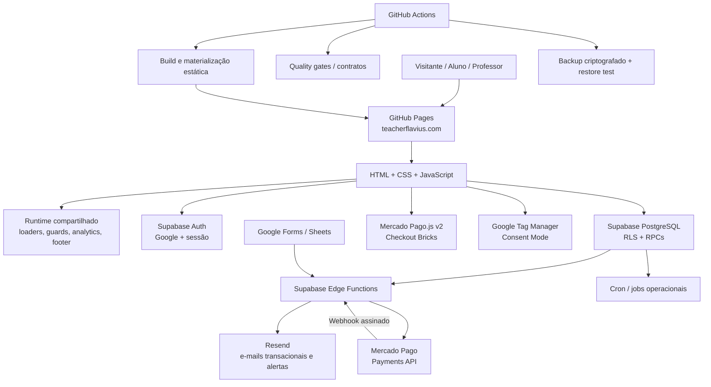

# Teacher Flávio — Plataforma de Ensino de Inglês

<!-- markdownlint-disable MD013 -->

Plataforma web do **Teacher Flávio** para aquisição de alunos, matrícula, autenticação, ensino de inglês e administração acadêmica, operacional e financeira.

Produção: [teacherflavius.com](https://teacherflavius.com)  
Acesso direto do aluno: [teacherflavius.com/acesso-aluno/](https://teacherflavius.com/acesso-aluno/)

O projeto combina um frontend estático em HTML, CSS e JavaScript com Supabase para autenticação, PostgreSQL, Row Level Security, RPCs, jobs agendados e Edge Functions. Integrações externas incluem Mercado Pago, Resend, Google OAuth, Google Forms/Sheets e Google Tag Manager.

## Estado atual

Em 10 de setembro de 2026, o projeto possui:

- frontend estático publicado pelo GitHub Pages com domínio próprio;
- pipeline de materialização e validação do HTML antes da publicação;
- autenticação Supabase com Google como fluxo principal e acesso por senha restrito a fluxos legados autorizados;
- MFA para operações administrativas sensíveis do professor;
- banco PostgreSQL protegido por RLS, RPCs, privilégios explícitos e objetos privados de servidor;
- módulos acadêmicos de alunos, turmas, frequência, lições, exercícios, flashcards e reposições;
- módulo financeiro com mensalidades, Pix/cartão, reconciliação, reembolsos, chargebacks, health financeiro e kill switch de novas cobranças;
- sincronização de exercícios recebidos por Google Forms;
- observabilidade com monitor de erros, CSP reporting, health interno, probes sintéticos e verificação externa de disponibilidade;
- analytics com Consent Mode, Google Tag Manager e eventos de aquisição, formulários e pagamentos;
- suíte automatizada de qualidade em JavaScript e Python;
- backup lógico criptografado do Supabase e teste automatizado de restauração;
- baseline versionado para reconstrução do banco em recuperação de desastre.

Os experimentos históricos de **pronúncia com IA** e **MCP V1** estão deliberadamente adiados e não fazem parte da aplicação ativa. Consulte [Decisões de arquitetura](#decisões-de-arquitetura).

## Arquitetura



### Frontend e runtime compartilhado

O frontend não usa um framework SPA nem um bundler de aplicação. As páginas continuam sendo HTML estático, mas a produção possui uma etapa de **build/materialização** que garante dependências, runtime comum, SEO, analytics, segurança e compatibilidade entre páginas.

Componentes centrais:

| Arquivo | Responsabilidade |
| --- | --- |
| `module_loader.js` | carregamento previsível de módulos e dependências |
| `site_asset_loader.js` | carregamento de assets compartilhados |
| `site_runtime_config.js` | configuração comum do runtime |
| `site_page_runtime.js` | comportamento transversal das páginas |
| `site_privacy_analytics.js` | integração de privacidade/analytics |
| `site_footer.js` / `site_footer_renderer.js` | rodapé institucional compartilhado |
| `error_monitor.js` | captura de falhas de aplicação e recursos |
| `responsive_compat.css` | baseline de compatibilidade responsiva |
| `brand_palette.css` | tokens e identidade visual compartilhada |

A ordem das dependências de scripts é validada e, quando necessário, materializada automaticamente pelos scripts em `scripts/`.

### Backend no Supabase

O Supabase fornece:

- Auth e identidades;
- PostgreSQL;
- RLS e grants explícitos;
- RPCs para APIs de aluno e professor;
- schema `private` para dados e rotinas exclusivamente de servidor;
- Edge Functions em TypeScript/Deno;
- Vault para segredos usados por rotinas do banco;
- Cron para reconciliações, retenção e monitoramento operacional.

O navegador usa apenas configuração pública do Supabase. `service_role`, senhas de banco, tokens privados e segredos de terceiros nunca devem ser colocados no frontend ou versionados.

## Tecnologias

| Camada | Tecnologia |
| --- | --- |
| Hospedagem | GitHub Pages + domínio personalizado |
| Frontend | HTML, CSS e JavaScript |
| Build/materialização | Python 3 + scripts próprios |
| Qualidade JS | Node.js 22, Node Test Runner e ESLint 9 |
| Cliente de dados | `@supabase/supabase-js` v2 |
| Autenticação | Supabase Auth + Google OAuth |
| Banco | PostgreSQL do Supabase |
| Autorização | RLS, grants e RPCs PostgreSQL |
| Backend server-side | Supabase Edge Functions / Deno |
| E-mail | Resend |
| Pagamentos | Mercado Pago Checkout Bricks + Payments API |
| Exercícios externos | Google Forms + Google Sheets + Apps Script |
| Analytics | Google Tag Manager + Consent Mode + módulos próprios |
| CI/CD e operações | GitHub Actions |
| Backup | Supabase CLI/`pg_dump`, GnuPG AES-256 e restore automatizado |

## Experiências da plataforma

Há três superfícies principais.

### Visitante

O visitante pode conhecer o serviço, consultar informações comerciais, iniciar matrícula e acessar a autenticação.

Rotas relevantes:

| Rota | Finalidade |
| --- | --- |
| `/` | home pública |
| `/curso-de-ingles-online/` | página pública do curso |
| `/quero-conhecer/` | apresentação comercial e captação |
| `/matricula/` | matrícula e onboarding |
| `/login/` | autenticação |
| `/acesso-aluno/` | entrada direta para a área do estudante |

### Aluno autenticado

| Rota | Finalidade |
| --- | --- |
| `/area-do-estudante/` | menu principal do aluno |
| `/perfil/` | dados pessoais e histórico |
| `/minha-turma/` | turma, videoaula, materiais e gravações |
| `/frequencia/` | histórico de lições e frequência |
| `/roteiro-de-estudos/` | roteiro e progresso individual |
| `/exercicios-diarios/` | exercícios publicados |
| `/flashcards/` | decks, prática e repetição espaçada |
| `/reposicoes/` | consulta, reserva e cancelamento de reposições |
| `/pagamento/` | pagamento de mensalidades |
| `/aulas-de-gramatica.html` | aulas e exercícios de gramática |
| `/guia-do-estudante.html` | orientações do curso |

Algumas páginas `.html` na raiz continuam existindo por compatibilidade histórica; as rotas com diretório e `index.html` são preferidas quando disponíveis.

### Professor / administração

| Rota | Finalidade |
| --- | --- |
| `/professor/` | painel principal do professor |
| `/perfil-dos-alunos/` | gestão de alunos e dados acadêmicos |
| `/turmas/` | gestão de turmas |
| `/quadro-de-turmas.html` | visão operacional das turmas |
| `/mensalidades/` | administração financeira |
| `/reposicoes-admin/` | gestão de horários e reservas de reposição |
| `/criar-exercicio/` | publicação de exercícios |
| `/exercicios-dos-alunos/` | acompanhamento de atividades |
| `/acessos-dos-alunos/` | relatório de acesso ao portal |
| `/relatorios/` | relatórios administrativos |
| `/saude-do-sistema/` | saúde operacional consolidada |
| `/solicitacoes-de-privacidade/` | fluxo administrativo de solicitações de privacidade |
| `/aulas-de-gramatica-interface-do-professor.html` | gestão das aulas de gramática |

Operações administrativas sensíveis usam verificação de professor e, nos fluxos protegidos mais recentes, MFA.

## Domínios funcionais

### Autenticação, matrícula e identidade

O fluxo atual prioriza **Google OAuth**. O sistema consegue vincular uma matrícula preexistente à identidade Google do aluno para preservar histórico e dados acadêmicos. Há também suporte controlado a autenticação por senha para contas/fluxos previamente autorizados.

Módulos relevantes incluem:

- `auth.js` e serviços `auth_*`;
- `google_auth_ui.js` e `google_auth_renderer.js`;
- `student_area_route_guard.js`;
- `student_enrollment_service.js`;
- `student_profile_service.js`;
- `professor_mfa_service.js` e `professor_mfa_gate.js`.

### Alunos, turmas, lições e frequência

O domínio acadêmico cobre:

- alunos ativos e arquivados;
- associação de alunos a turmas;
- tipos, horários, capacidade e ordenação de turmas;
- links de videoaula, materiais, grupo e aulas gravadas;
- registro de lições;
- frequência;
- preservação de histórico em mudanças de turma;
- relatórios de vagas e acompanhamento pedagógico.

### Exercícios e roteiro de estudos

O professor pode publicar exercícios e acompanhar conclusão/progresso. O projeto também mantém atividades HTML tradicionais para prática pedagógica, usando `quiz_core.js` e armazenamento de resultados no Supabase.

A integração com Google Forms segue o fluxo:

```text
Google Forms → Google Sheets → Apps Script → Edge Function → Supabase
```

Consulte [GOOGLE_FORMS_EVENT_SYNC.md](GOOGLE_FORMS_EVENT_SYNC.md).

### Flashcards

O módulo de flashcards possui:

- decks por aluno;
- cards e ordenação;
- prática registrada;
- repetição espaçada;
- camada visual institucional em `flashcards/flashcards_visual.css` e `flashcards/flashcards_visual.js`.

### Reposições

O módulo de reposições administra horários, capacidade, reserva, cancelamento e devolução de vagas. Eventos de reserva/cancelamento podem produzir notificações transacionais.

Datas são armazenadas de forma consistente no backend e apresentadas ao usuário em `America/Sao_Paulo` quando aplicável.

Consulte [CONFIGURAR_REPOSICOES.md](CONFIGURAR_REPOSICOES.md).

### Mensalidades e pagamentos

O domínio financeiro evoluiu além do simples registro manual de mensalidades. Atualmente inclui:

- mensalidades por aluno;
- valor individual, vencimento, situação e histórico;
- avisos globais de cobrança;
- checkout do aluno;
- Pix e cartão via Mercado Pago Checkout Bricks;
- Payments API (`/v1/payments`);
- idempotência na criação de pagamentos;
- webhook assinado;
- reconciliação de pagamentos;
- log operacional de webhooks;
- candidatos e operações de reembolso;
- acompanhamento de chargebacks e documentação;
- health financeiro;
- alertas operacionais;
- kill switch para bloquear novas cobranças em incidente sem impedir leitura/reconciliação do estado existente.

Exemplos de Edge Functions desse domínio:

- `create-mercado-pago-payment`;
- `mercado-pago-webhook`;
- `reconcile-mercado-pago-payments`;
- `list-mercado-pago-refund-candidates`;
- `list-mercado-pago-chargebacks`;
- `manage-mercado-pago-chargeback-documentation`;
- `manage-payment-creation-control`;
- `list-payment-webhooks`.

Configuração e operação:

- [CONFIGURAR_MERCADO_PAGO.md](CONFIGURAR_MERCADO_PAGO.md)
- [docs/mercado_pago_testing.md](docs/mercado_pago_testing.md)
- [docs/payment_access_security.md](docs/payment_access_security.md)
- [docs/payment_financial_health.md](docs/payment_financial_health.md)
- [docs/payment_alerting.md](docs/payment-alerting.md)
- [docs/payment_kill_switch.md](docs/payment_kill_switch.md)
- [docs/payment_incident_runbook.md](docs/payment_incident_runbook.md)

### Privacidade e LGPD

O sistema trabalha com dados pessoais e acadêmicos, incluindo nome, e-mail, informações de matrícula, progresso, pagamentos e histórico de uso necessário à operação do portal.

O projeto possui:

- Consent Mode antes da ativação de analytics;
- fluxo de solicitações do titular de dados;
- políticas RLS específicas;
- minimização de dados no rastreamento de acessos;
- retenção operacional para diferentes categorias de log;
- separação entre dados de cliente e objetos privados de servidor.

Dados reais nunca devem ser adicionados a issues, commits, PRs, fixtures públicas, logs ou documentação.

### Analytics e aquisição

O analytics é modularizado em arquivos como:

- `analytics.js`;
- `analytics_utils.js`;
- `analytics_acquisition.js`;
- `analytics_forms.js`;
- `analytics_payments.js`.

O Google Tag Manager é materializado nas páginas pelo pipeline. O Consent Mode inicia armazenamento de analytics/anúncios como negado até que a escolha aplicável do usuário seja processada.

### E-mails transacionais

O Resend é usado por Edge Functions para notificações e alertas. Entre os fluxos estão matrícula, reposições e saúde operacional.

As rotinas máquina-a-máquina não devem confiar em endpoints públicos sem autenticação própria. Os webhooks internos usam segredos compartilhados e os fluxos de usuário usam JWT e, quando exigido, MFA.

### Observabilidade e saúde do sistema

Há duas camadas complementares.

**Dentro da aplicação:**

- `error_monitor.js` registra erros e falhas de recursos;
- `app-error-report` recebe eventos de aplicação;
- `csp-report` recebe violações de CSP;
- o monitor global executa probes sintéticos e consolida sinais operacionais;
- `/saude-do-sistema/` mostra o painel administrativo;
- alertas são deduplicados e enviados pelo fluxo operacional de notificações.

**Fora da aplicação:**

- o workflow `Production availability` verifica produção pelo GitHub Actions;
- `health.json` fornece um contrato simples de disponibilidade da camada estática.

O monitor interno roda em ciclos frequentes e possui watchdog para detectar a própria interrupção. Detalhes: [docs/system_health_monitoring.md](docs/system_health_monitoring.md).

## Edge Functions

As funções versionadas vivem em `supabase/functions/`. A lista cresce conforme os domínios são extraídos do frontend; consulte o diretório como inventário canônico.

Categorias atuais incluem:

| Categoria | Exemplos |
| --- | --- |
| Erros e segurança | `app-error-report`, `csp-report` |
| Exercícios | `google-forms-exercise-sync`, `google-forms-integration-manager`, `exercise-sync-runner` |
| Pagamentos | criação, webhook, reconciliação, refunds, chargebacks e kill switch |
| Marketing | `marketing-acquisition-event` |
| Saúde operacional | `get-system-health-dashboard`, probes e notificações de health |
| Notificações | matrícula, reposições e alertas operacionais |

Não exponha `service_role` ou secrets dessas funções ao navegador.

## Banco de dados e recuperação

### Migrações e baseline

O repositório possui três tipos de material SQL, com finalidades diferentes:

1. `supabase/migrations/` — histórico versionado de mudanças de desenvolvimento e produção mais recentes;
2. `supabase/baseline/` — **baseline canônico de reconstrução do schema** para disaster recovery;
3. arquivos `supabase_*.sql` na raiz — scripts históricos, bootstrap e correções pontuais preservados por compatibilidade/auditoria.

Importante: o histórico de migrations do projeto não forma, sozinho, uma cadeia completa capaz de reconstruir um banco vazio. Para recuperação de desastre, siga `supabase/baseline/README.md` e `BACKUP_RECOVERY.md`; não execute indiscriminadamente todos os SQLs históricos.

O baseline deliberadamente não contém linhas de alunos, pagamentos, usuários Auth ou valores de segredos. Um `migration-ledger.csv` preserva o inventário técnico necessário sem publicar dados pessoais que existiram em migrações históricas remotas.

### Backup e restore

O projeto mantém uma camada própria de recuperação, independente de qualquer backup gerenciado da plataforma:

- backup lógico de produção em GitHub Actions;
- payload criptografado com GnuPG AES-256 antes do upload;
- retenção diferenciada para backups diários e mensais;
- hash de integridade;
- manifest técnico de recuperação;
- restauração automática em uma stack Supabase descartável após backup bem-sucedido;
- comparação do estado restaurado com o manifest;
- exercício de RTO registrado pela automação.

O workflow de backup é diário. Um backup só deve ser considerado **recovery-verified** quando o workflow de restauração subsequente também concluir com sucesso.

Procedimento completo: [BACKUP_RECOVERY.md](BACKUP_RECOVERY.md).

## Estrutura do repositório

| Caminho | Responsabilidade |
| --- | --- |
| `*.html`, diretórios com `index.html` | páginas públicas, de aluno e administrativas |
| `*.js`, `*.css` | módulos de frontend e estilos |
| `flashcards/` | camada visual e rota do módulo de flashcards |
| `pagamento/` | checkout e componentes financeiros do aluno |
| `integracao-google-forms/` | interface de gestão da integração de exercícios |
| `supabase/functions/` | Edge Functions |
| `supabase/migrations/` | migrations versionadas disponíveis no repositório |
| `supabase/baseline/` | baseline seguro de reconstrução do banco |
| `supabase/recovery/` | manifest e suporte à verificação de restore |
| `scripts/` | build, materialização, validações, backup e ferramentas operacionais |
| `tests/` | testes Node.js e Python |
| `.github/workflows/` | CI, validações, health e automações operacionais |
| `docs/` | runbooks, segurança, health, pagamentos e decisões |
| `CNAME` | domínio personalizado do GitHub Pages |
| `package.json` | comandos de qualidade e contratos automatizados |

## Desenvolvimento local

### Pré-requisitos

Para trabalhar no frontend e executar a suíte completa:

- Python 3;
- Node.js 22;
- npm.

O Supabase CLI só é necessário para tarefas de banco, Edge Functions ou recuperação que realmente dependam da infraestrutura local/remota.

### Instalar ferramentas de qualidade

```bash
npm install --ignore-scripts --no-audit --no-fund
```

### Servir a árvore de desenvolvimento

```bash
python3 -m http.server 8000
```

Abra <http://localhost:8000>.

Não use `file://`: o projeto depende de rotas HTTP, módulos, autenticação e requisições de rede.

### Executar qualidade local

```bash
npm run quality
```

Esse comando executa:

1. `node --check` nos módulos JavaScript monitorados;
2. ESLint;
3. testes Node (`node --test`);
4. testes Python (`unittest`).

Há comandos específicos em `package.json` para contratos de pagamento, materialização, build estático, runtime e componentes individuais.

### Simular o pipeline estático

```bash
python3 scripts/build_static_site.py
python3 scripts/materialize_site.py --profile publish
python3 scripts/postprocess_production.py
python3 -m http.server 4173 --directory _site
```

O diretório `_site/` é um workspace de publicação/validação gerado. O pipeline rejeita vazamento de arquivos operacionais como Markdown, SQL, Python, workflows e arquivos de configuração que não pertencem ao site público.

## CI e quality gates

GitHub Actions valida PRs e mudanças em `main`. Entre os workflows ativos estão:

| Área | Validação |
| --- | --- |
| Clean Code | sintaxe JS, ESLint, testes Node e Python via `npm run quality` |
| Segurança | baseline de segurança, CSP, conteúdo público e contratos relacionados |
| Dependências | baseline das dependências e carregamento correto de scripts |
| Acessibilidade | validações automatizadas de baseline |
| Responsividade | compatibilidade entre páginas |
| URLs | política de rotas limpas e aliases |
| SEO | auditoria técnica de páginas públicas |
| Performance | budgets estáticos + Lighthouse mobile |
| Build estático | geração, materialização e inspeção de `_site` |
| Produção | disponibilidade das rotas críticas e `health.json` |
| Pagamentos | contratos do gateway, idempotência, reconciliação, refunds, chargebacks e controles |
| System health | contratos do monitor global e dashboard |
| Backup | geração criptografada, validação do baseline e restore automatizado |

O Lighthouse é um teste de laboratório e pode apresentar variação entre runners. Uma falha deve ser investigada pelo relatório e pelos valores medidos; não deve ser mascarada quando for causada pela mudança em análise.

Testes automatizados reduzem regressões, mas não substituem smoke tests de integrações externas como OAuth, Mercado Pago, Resend e Google Forms quando essas integrações forem alteradas.

## Pipeline de publicação

A aplicação de produção usa **GitHub Pages**.

Fluxo de código:

1. criar branch a partir de `main`;
2. implementar a mudança com Clean Code;
3. executar os testes aplicáveis;
4. abrir Pull Request;
5. aguardar/analisar quality gates;
6. fazer merge em `main`;
7. quando páginas HTML exigirem materialização, o workflow específico materializa os elementos gerados e atualiza `main`;
8. validar produção.

O workflow `Static hosting build` também produz `_site/` para validar o artefato estático, dependências, arquivos obrigatórios e ausência de vazamentos.

O merge de código **não** substitui ações de infraestrutura que precisem ser executadas no Supabase ou em provedores externos. Migrações, secrets, configuração de OAuth/webhooks e deploy de Edge Functions devem seguir o runbook do módulo correspondente.

Ao alterar um asset versionado por query string, mantenha o `?v=` coerente quando isso for necessário para invalidar cache.

## Segurança

Princípios atuais:

- o repositório é público; nenhum secret operacional pode ser versionado;
- `anon` e `authenticated` recebem somente privilégios explicitamente necessários;
- RLS e grants são tratados como camadas separadas;
- funções administrativas verificam a identidade do professor;
- operações administrativas sensíveis recentes exigem MFA;
- `service_role` é exclusiva de servidor;
- rotinas privadas e dados operacionais sensíveis preferem o schema `private`;
- webhooks máquina-a-máquina usam autenticação própria;
- segredos acionados pelo banco podem ser armazenados no Vault;
- CSP e erros de aplicação possuem canais de observabilidade;
- novas cobranças podem ser interrompidas pelo kill switch financeiro sem destruir o histórico;
- backups são criptografados antes de sair do runner.

Documentação relacionada:

- [SUPABASE_SEGURANCA.md](SUPABASE_SEGURANCA.md)
- [docs/global_security_hardening_20260910.md](docs/global_security_hardening_20260910.md)
- [docs/payment_access_security.md](docs/payment_access_security.md)

## Configuração e secrets

`supabase_config.js` deve conter apenas valores públicos necessários ao cliente, como URL do projeto e chave pública apropriada ao frontend.

Secrets devem permanecer em Supabase, GitHub Actions ou no provedor correspondente, conforme o módulo. Exemplos de categorias:

- credenciais privadas do Mercado Pago;
- credenciais do Resend;
- segredos de webhooks;
- credenciais de conexão do banco para backup;
- passphrase de criptografia de backup;
- segredos de sincronização de exercícios;
- configuração server-side de health/alertas.

Nunca copie secrets para documentação, mensagens de PR, logs ou arquivos do frontend.

## Operação e observabilidade

Antes de considerar uma alteração operacional concluída, valide a camada apropriada:

### Aplicação

- autenticação e guards;
- rotas afetadas;
- ausência de erros no navegador;
- comportamento mobile;
- eventos esperados de analytics, quando aplicável.

### Banco

- migration/RPC aplicada quando necessária;
- grants e RLS;
- invariantes de integridade;
- jobs agendados afetados;
- Advisors do Supabase quando pertinente.

### Integrações

- logs das Edge Functions;
- Resend;
- Mercado Pago e assinatura de webhook;
- Google Forms/Sheets/Apps Script;
- OAuth.

### Saúde

- `health.json`;
- workflow `Production availability`;
- `/saude-do-sistema/` para sinais internos;
- health financeiro para incidentes de pagamento;
- monitor de erros/CSP para regressões de frontend e políticas.

## Decisões de arquitetura

### Pronúncia com IA — adiada

Uma implementação experimental de avaliação automática de pronúncia foi encerrada sem merge produtivo. A retomada exige nova implementação sobre o `main` vigente, credenciais/configuração próprias e validação ponta a ponta antes de exposição aos alunos.

Registro: [docs/decisions/2026-09-10-pronunciation-ai-deferred.md](docs/decisions/2026-09-10-pronunciation-ai-deferred.md).

### MCP V1 — adiado

O protótipo histórico de servidor MCP read-only também não foi promovido. A retomada deve partir da arquitetura atual e atender autenticação/autorização adequadas para produção, em vez de reutilizar o bootstrap antigo com bearer token estático.

Registro: [docs/decisions/2026-09-10-mcp-v1-deferred.md](docs/decisions/2026-09-10-mcp-v1-deferred.md).

## Documentação operacional

| Documento | Assunto |
| --- | --- |
| [SUPABASE_SETUP.md](SUPABASE_SETUP.md) | configuração inicial do Supabase |
| [SUPABASE_SEGURANCA.md](SUPABASE_SEGURANCA.md) | segurança e hardening do Supabase |
| [BACKUP_RECOVERY.md](BACKUP_RECOVERY.md) | backup, criptografia e disaster recovery |
| [supabase/baseline/README.md](supabase/baseline/README.md) | baseline canônico de reconstrução |
| [CONFIGURAR_REPOSICOES.md](CONFIGURAR_REPOSICOES.md) | módulo de reposições |
| [CONFIGURAR_EMAIL_MATRICULAS.md](CONFIGURAR_EMAIL_MATRICULAS.md) | notificações de matrícula |
| [CONFIGURAR_MERCADO_PAGO.md](CONFIGURAR_MERCADO_PAGO.md) | integração financeira |
| [GOOGLE_FORMS_EVENT_SYNC.md](GOOGLE_FORMS_EVENT_SYNC.md) | sincronização de exercícios |
| [docs/system_health_monitoring.md](docs/system_health_monitoring.md) | monitoramento global de saúde |
| [docs/payment_incident_runbook.md](docs/payment_incident_runbook.md) | resposta a incidentes financeiros |
| [docs/global_security_hardening_20260910.md](docs/global_security_hardening_20260910.md) | hardening global mais recente |

## Convenções de manutenção

- aplicar Clean Code em código novo e refatorações;
- preferir módulos pequenos, responsabilidades explícitas e dependências testáveis;
- manter funções de infraestrutura e regras de domínio fora de renderizadores quando possível;
- adicionar ou atualizar testes para contratos relevantes;
- evitar duplicação de lógica entre páginas;
- preservar compatibilidade das rotas legadas apenas quando necessária;
- não aplicar SQL histórico indiscriminadamente;
- não publicar secrets ou dados pessoais;
- manter documentação e runbooks sincronizados com a implementação vigente.

## Público-alvo

A plataforma atende alunos de inglês do Teacher Flávio e o professor responsável pela operação pedagógica, administrativa e financeira do curso.
