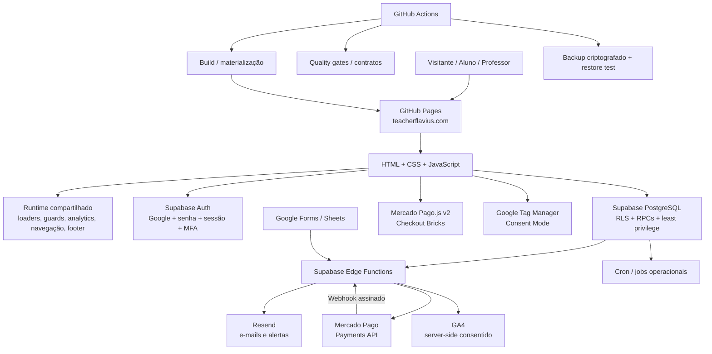

# Teacher Flávio — Plataforma de Ensino de Inglês

<!-- markdownlint-disable MD013 -->

Plataforma web do **Teacher Flávio** para aquisição de alunos, matrícula, autenticação, ensino de inglês e administração acadêmica, operacional e financeira.

Produção: [teacherflavius.com](https://teacherflavius.com)  
Acesso direto do aluno: [teacherflavius.com/acesso-aluno/](https://teacherflavius.com/acesso-aluno/)

O projeto combina frontend estático em HTML, CSS e JavaScript com Supabase para autenticação, PostgreSQL, Row Level Security (RLS), RPCs, jobs agendados e Edge Functions. Integrações externas incluem Mercado Pago, Resend, Google OAuth, Google Forms/Sheets e Google Tag Manager.

## Estado atual

Em 24 de setembro de 2026, a plataforma possui:

- frontend estático publicado pelo GitHub Pages com domínio próprio;
- pipeline de build, materialização e validação do HTML antes da publicação;
- autenticação Supabase com Google OAuth, senha, MFA/AAL2 e controles de sessão administrativa;
- banco PostgreSQL protegido por RLS, grants de menor privilégio, RPCs e objetos privados de servidor;
- módulos acadêmicos de alunos, turmas, frequência, lições, exercícios, flashcards, roteiro de estudos e reposições;
- páginas de lição gerenciáveis no Roteiro de Estudos, com criação dinâmica de cards, numeração editorial, tradução e fallback para PDFs;
- classificação de turmas `INDIVIDUAL`, `QUARTETO`, `QUINTETO` e `8 ALUNOS`, com compatibilidade entre aluno e turma;
- capacidade adicional específica para reservas de reposição, separada da ocupação regular da turma;
- módulo **Alunos do dia** na Área do Professor, com agenda diária, lição a apresentar, contato por WhatsApp e registro de falta ao cancelar aula;
- gestão de aulas experimentais com edição de agendamentos e registro de conversão em matrícula;
- módulo financeiro com mensalidades, overrides mensais preservados, Pix/cartão, reconciliação, reembolsos, chargebacks, health financeiro e kill switch de novas cobranças;
- páginas comerciais específicas para aulas individuais e aulas em grupo ao vivo, integradas ao funil de aquisição e ao SEO;
- analytics de pagamentos server-side condicionado ao consentimento e monitoramento específico de CTAs comerciais;
- sincronização de exercícios recebidos por Google Forms;
- observabilidade com monitor de erros, CSP reporting, health interno, probes sintéticos e verificação externa de disponibilidade;
- suíte automatizada de qualidade em JavaScript e Python, contratos dedicados de autenticação, pagamentos e fluxos operacionais;
- backup lógico criptografado do Supabase, teste automatizado de restauração e baseline versionado para disaster recovery.

Os experimentos históricos de **pronúncia com IA** e **MCP V1** permanecem adiados e não fazem parte da aplicação ativa.

## Arquitetura



### Frontend e runtime

O frontend não usa framework SPA nem bundler de aplicação. As páginas permanecem HTML estático, com uma etapa de build/materialização que garante dependências, runtime comum, SEO, analytics, segurança e compatibilidade entre páginas.

Componentes centrais:

| Arquivo | Responsabilidade |
| --- | --- |
| `module_loader.js` | carregamento previsível de módulos e dependências |
| `site_asset_loader.js` | carregamento de assets compartilhados com caminhos seguros para URLs limpas |
| `site_runtime_config.js` | configuração comum do runtime |
| `site_page_runtime.js` | comportamento transversal das páginas |
| `site_privacy_analytics.js` | privacidade e analytics |
| `site_footer.js` / `site_footer_renderer.js` | rodapé institucional compartilhado |
| `error_monitor.js` | captura de falhas de aplicação e recursos |
| `responsive_compat.css` | baseline responsivo |
| `brand_palette.css` | tokens da identidade visual |

A navegação compartilhada é centralizada e materializada/carregada de forma consistente nas páginas publicadas, evitando duplicação de comportamento entre áreas do site.

### Backend no Supabase

O Supabase fornece Auth, PostgreSQL, RLS, grants explícitos, RPCs, schema `private`, Edge Functions em TypeScript/Deno, Vault e Cron.

O navegador usa somente configuração pública. `service_role`, senhas de banco, tokens privados e segredos de terceiros nunca devem ser colocados no frontend ou versionados.

## Tecnologias

| Camada | Tecnologia |
| --- | --- |
| Hospedagem | GitHub Pages + domínio personalizado |
| Frontend | HTML, CSS e JavaScript |
| Build/materialização | Python 3 + scripts próprios |
| Qualidade JS | Node.js 22, Node Test Runner e ESLint 9 |
| Cliente de dados | `@supabase/supabase-js` v2 |
| Autenticação | Supabase Auth + Google OAuth + senha + MFA |
| Banco | PostgreSQL do Supabase |
| Autorização | RLS, grants de menor privilégio e RPCs |
| Backend server-side | Supabase Edge Functions / Deno |
| E-mail | Resend |
| Pagamentos | Mercado Pago Checkout Bricks + Payments API |
| Exercícios externos | Google Forms + Google Sheets + Apps Script |
| Analytics | Google Tag Manager + Consent Mode + GA4 server-side consentido |
| CI/CD e operações | GitHub Actions |
| Backup | Supabase CLI/`pg_dump`, GnuPG AES-256 e restore automatizado |

> O projeto **não utiliza Netlify**. A publicação de produção permanece no GitHub Pages. Não introduza dependências, configuração ou acoplamento com Netlify.

## Experiências da plataforma

### Visitante

| Rota | Finalidade |
| --- | --- |
| `/` | hub público dos formatos de aula |
| `/curso-de-ingles-online/` | página pública do curso |
| `/aulas-em-grupo/` | aulas em grupo ao vivo |
| `/aulas-individuais/` | aulas individuais |
| `/quero-conhecer/` | apresentação comercial e captação |
| `/matricula/` | matrícula e onboarding |
| `/login/` | autenticação |
| `/acesso-aluno/` | entrada direta para a área do estudante |

### Aluno autenticado

| Rota | Finalidade |
| --- | --- |
| `/area-do-estudante/` | menu principal |
| `/perfil/` | dados pessoais, histórico e segurança da conta |
| `/minha-turma/` | turma, videoaula, materiais e gravações |
| `/frequencia/` | lições e frequência |
| `/roteiro-de-estudos/` | roteiro, páginas de lição e progresso individual |
| `/exercicios-diarios/` | exercícios publicados |
| `/flashcards/` | decks, prática e repetição espaçada |
| `/reposicoes/` | consulta, reserva e cancelamento de reposições |
| `/pagamento/` | pagamento de mensalidades |
| `/aulas-de-gramatica.html` | aulas e exercícios de gramática |
| `/guia-do-estudante.html` | orientações do curso |

### Professor / administração

| Rota | Finalidade |
| --- | --- |
| `/professor/` | painel principal |
| `/alunos-do-dia/` | agenda operacional diária dos alunos |
| `/perfil-dos-alunos/` | gestão de alunos e dados acadêmicos |
| `/turmas/` | gestão de turmas |
| `/quadro-de-turmas.html` | visão operacional das turmas |
| `/mensalidades/` | administração financeira |
| `/reposicoes-admin/` | horários e reservas de reposição |
| `/criar-exercicio/` | publicação de exercícios |
| `/exercicios-dos-alunos/` | acompanhamento de atividades |
| `/acessos-dos-alunos/` | relatório de acesso protegido por MFA |
| `/relatorios/` | relatórios administrativos |
| `/saude-do-sistema/` | saúde operacional consolidada |
| `/solicitacoes-de-privacidade/` | solicitações de privacidade |

Operações administrativas sensíveis exigem identidade de professor, AAL2/MFA e, quando aplicável, sessão Supabase ativa correspondente ao JWT.

## Domínios funcionais

### Autenticação, identidade e segurança de conta

O sistema suporta Google OAuth e fluxos autorizados por senha. A camada de autenticação inclui senha mínima de 12 caracteres, reautenticação para alteração voluntária, revogação global após recuperação, logout global, throttling progressivo, mensagens neutras de recuperação, timeout de inatividade administrativa, MFA/AAL2 para operações sensíveis e contratos dedicados de CI.

A vinculação de uma identidade Google a matrícula existente preserva dados acadêmicos. Variantes equivalentes de Gmail com diferenças de pontos são normalizadas com validações de segurança para evitar perda de matrícula, turma e progresso.

### Alunos, turmas, lições e exercícios

O domínio acadêmico cobre alunos ativos/arquivados, turmas, horários, capacidade, materiais, frequência, lições, exercícios e roteiro individual. O histórico é persistente: arquivar/desarquivar aluno e vincular identidades não deve apagar progresso.

As turmas suportam classificações `INDIVIDUAL`, `QUARTETO`, `QUINTETO` e `8 ALUNOS`. A compatibilidade de matrícula entre o tipo do aluno e o tipo da turma é validada no backend. Exceções operacionais de capacidade devem permanecer documentadas e cobertas por testes.

O Roteiro de Estudos suporta páginas de lição gerenciáveis e expansão dinâmica além do conjunto inicial de lições. O conteúdo pode incluir número editorial, tradução e fallback para materiais em PDF.

### Alunos do dia e aulas experimentais

O painel **Alunos do dia** concentra a operação diária do professor: lista os alunos previstos, informa a lição a apresentar, oferece contato por WhatsApp e registra falta quando uma aula é cancelada pelo fluxo correspondente.

A gestão de aulas experimentais permite editar agendamentos e registrar se a aula resultou em matrícula, fornecendo sinal de conversão para a operação comercial.

### Flashcards

O módulo possui decks por aluno, cards ordenados, prática registrada e repetição espaçada.

### Reposições

O módulo administra horários, capacidade, reserva, cancelamento e devolução de vagas. A capacidade de reposição possui vagas adicionais próprias, sem alterar a capacidade regular da turma. A sincronização automática preserva slots referenciados pelo histórico.

Consulte [CONFIGURAR_REPOSICOES.md](CONFIGURAR_REPOSICOES.md).

### Mensalidades e pagamentos

O domínio financeiro inclui mensalidades, valores e vencimentos, overrides mensais preservados, Pix e cartão via Mercado Pago, idempotência, validação de concorrência, webhook assinado, reconciliação, reembolsos, chargebacks, health financeiro, alertas, kill switch e analytics server-side consentido.

Documentação principal:

- [CONFIGURAR_MERCADO_PAGO.md](CONFIGURAR_MERCADO_PAGO.md)
- [docs/mercado_pago_testing.md](docs/mercado_pago_testing.md)
- [docs/payment_access_security.md](docs/payment_access_security.md)
- [docs/payment_financial_health.md](docs/payment_financial_health.md)
- [docs/payment_alerting.md](docs/payment-alerting.md)
- [docs/payment_kill_switch.md](docs/payment_kill_switch.md)
- [docs/payment_incident_runbook.md](docs/payment_incident_runbook.md)
- [docs/payment_server_analytics.md](docs/payment_server_analytics.md)
- [docs/payment_operational_readiness_report.md](docs/payment_operational_readiness_report.md)
- [docs/payment_credential_rotation.md](docs/payment_credential_rotation.md)
- [docs/payment_first_real_refund_validation.md](docs/payment_first_real_refund_validation.md)
- [docs/payment_provider_decision_gate.md](docs/payment_provider_decision_gate.md)

### Aquisição, SEO e analytics

A home funciona como hub dos formatos de aula. Páginas comerciais específicas atendem aulas individuais e aulas em grupo, com indexação, sitemap, metadados sociais e CTAs rastreados conforme o papel de cada página no funil.

Consent Mode é aplicado antes da ativação de analytics. Eventos financeiros server-side respeitam o consentimento capturado. Recursos editoriais não comerciais podem ser explicitamente excluídos do funil para não inflar métricas de aquisição.

Dados reais nunca devem ser adicionados a issues, commits, PRs, fixtures públicas, logs ou documentação.

### Observabilidade

A aplicação mantém captura de erros, CSP reporting, probes sintéticos, health interno e verificação externa de disponibilidade. O monitor filtra ruído conhecido de rede/telemetria para reduzir falsos positivos. `/saude-do-sistema/` consolida sinais administrativos, incluindo health de autenticação e pagamentos.

Detalhes: [docs/system_health_monitoring.md](docs/system_health_monitoring.md).

## Banco de dados e recuperação

O repositório separa:

1. `supabase/migrations/` — mudanças versionadas;
2. `supabase/baseline/` — baseline canônico de reconstrução;
3. `supabase/recovery/` — manifest e suporte à verificação de restore;
4. SQLs históricos na raiz — bootstrap/correções preservados para auditoria, não para execução indiscriminada.

O baseline não contém linhas reais de alunos, pagamentos, usuários Auth ou valores de segredos. A recuperação usa backup lógico criptografado, hash de integridade, manifest e restauração automatizada em stack descartável.

Procedimento: [BACKUP_RECOVERY.md](BACKUP_RECOVERY.md).

## Estrutura do repositório

| Caminho | Responsabilidade |
| --- | --- |
| `*.html`, diretórios com `index.html` | páginas públicas, do aluno e administrativas |
| `*.js`, `*.css` | frontend e estilos |
| `flashcards/` | módulo de flashcards |
| `pagamento/` | checkout e componentes financeiros |
| `integracao-google-forms/` | gestão da integração de exercícios |
| `supabase/functions/` | Edge Functions |
| `supabase/migrations/` | migrations |
| `supabase/baseline/` | baseline de reconstrução |
| `supabase/recovery/` | verificação de restore |
| `scripts/` | build, materialização, validações e operações |
| `tests/` | testes Node.js e Python |
| `.github/workflows/` | CI, deploy, health e automações |
| `docs/` | runbooks e decisões técnicas |
| `CNAME` | domínio do GitHub Pages |
| `package.json` | comandos de qualidade |

## Desenvolvimento local

### Pré-requisitos

- Python 3;
- Node.js 22;
- npm.

Supabase CLI é necessário apenas para tarefas de banco, Edge Functions ou recuperação.

### Instalação

```bash
npm install --ignore-scripts --no-audit --no-fund
```

### Servidor local

```bash
python3 -m http.server 8000
```

Abra <http://localhost:8000>. Não use `file://`.

### Qualidade

```bash
npm run quality
```

O comando cobre sintaxe JavaScript, ESLint, testes Node e testes Python. Contratos especializados complementam a suíte para autenticação, pagamentos, segurança, build, runtime e fluxos operacionais.

### Simular publicação

```bash
python3 scripts/build_static_site.py
python3 scripts/materialize_site.py --profile publish
python3 scripts/postprocess_production.py
python3 -m http.server 4173 --directory _site
```

`_site/` é um artefato gerado para publicação/validação. O pipeline rejeita vazamento de arquivos operacionais que não pertencem ao site público.

## CI/CD e deploy

GitHub Actions valida PRs e mudanças em `main` com gates de Clean Code, autenticação, segurança, acessibilidade, responsividade, URLs, SEO, performance, build estático, produção, pagamentos, system health e backup/recovery.

O Lighthouse usa aquecimento e múltiplas amostras medidas para reduzir flutuação do runner sem relaxar os guardrails de performance.

Fluxo esperado:

1. criar branch a partir de `main`;
2. implementar com Clean Code;
3. executar testes aplicáveis;
4. abrir Pull Request;
5. aguardar quality gates;
6. fazer merge em `main` quando os checks estiverem verdes;
7. materializar/publicar quando aplicável;
8. validar produção.

A hospedagem de produção é **GitHub Pages**. Não introduza configuração ou dependência de Netlify.

O merge de código não substitui ações de infraestrutura no Supabase ou provedores externos. Migrações, secrets, OAuth/webhooks e deploy de Edge Functions devem seguir seus runbooks.

## Segurança

Princípios vigentes:

- nenhum secret operacional no repositório público;
- menor privilégio para `anon` e `authenticated`;
- RLS e grants como camadas independentes;
- MFA/AAL2 e sessão ativa para operações administrativas sensíveis;
- `service_role` exclusiva de servidor;
- schema `private` para rotinas/dados de servidor;
- autenticação própria para webhooks máquina-a-máquina;
- Vault para segredos acionados pelo banco;
- CSP, error monitoring e health checks;
- kill switch financeiro sem destruição do histórico;
- backups criptografados antes de sair do runner.

Consulte [SUPABASE_SEGURANCA.md](SUPABASE_SEGURANCA.md) e [docs/global_security_hardening_20260910.md](docs/global_security_hardening_20260910.md).

## Configuração e secrets

`supabase_config.js` contém somente valores públicos necessários ao cliente. Secrets permanecem no Supabase, GitHub Actions ou provedor correspondente.

Nunca copie secrets para documentação, PRs, logs ou frontend.

## Decisões de arquitetura

### Pronúncia com IA — adiada

A implementação experimental foi encerrada sem merge produtivo. Uma retomada deve partir do `main` vigente e passar por validação ponta a ponta.

Registro: [docs/decisions/2026-09-10-pronunciation-ai-deferred.md](docs/decisions/2026-09-10-pronunciation-ai-deferred.md).

### MCP V1 — adiado

O protótipo histórico não foi promovido. Uma retomada deve atender à arquitetura e aos controles atuais.

Registro: [docs/decisions/2026-09-10-mcp-v1-deferred.md](docs/decisions/2026-09-10-mcp-v1-deferred.md).

## Convenções de manutenção

- aplicar Clean Code em código novo e refatorações;
- manter módulos pequenos, responsabilidades explícitas e dependências testáveis;
- separar infraestrutura, domínio e renderização sempre que possível;
- adicionar/atualizar testes para contratos relevantes;
- evitar duplicação de lógica;
- preservar histórico acadêmico e financeiro em operações de ciclo de vida;
- preservar overrides financeiros explícitos ao recalcular ou regenerar mensalidades;
- não aplicar SQL histórico indiscriminadamente;
- não publicar secrets ou dados pessoais;
- manter README e runbooks sincronizados com a implementação vigente;
- não reintroduzir Netlify.

## Público-alvo

A plataforma atende alunos de inglês do Teacher Flávio e o professor responsável pela operação pedagógica, administrativa e financeira do curso.
