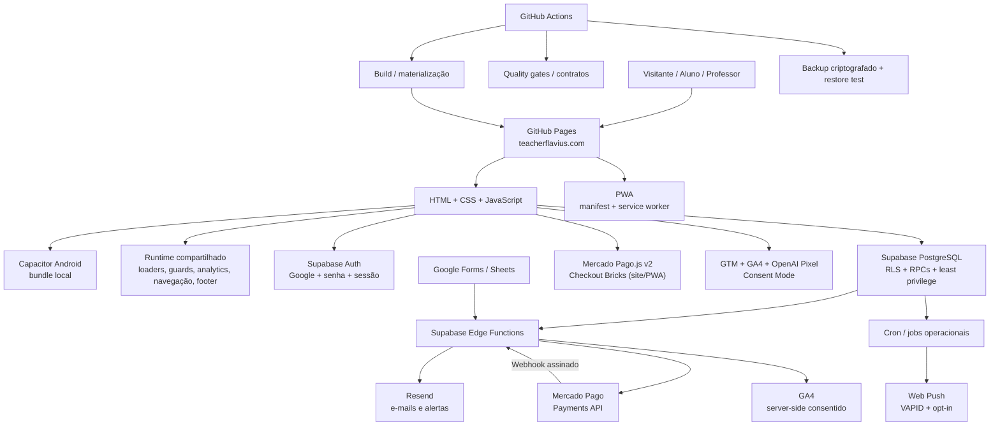

# Teacher Flávio — Plataforma de Ensino de Inglês

<!-- markdownlint-disable MD013 -->

Plataforma web do **Teacher Flávio** para aquisição de alunos, matrícula, autenticação, ensino de inglês e administração acadêmica, operacional e financeira.

Produção: [teacherflavius.com](https://teacherflavius.com)  
Acesso direto do aluno: [teacherflavius.com/acesso-aluno/](https://teacherflavius.com/acesso-aluno/)

O projeto combina frontend estático em HTML, CSS e JavaScript com Supabase para autenticação, PostgreSQL, Row Level Security (RLS), RPCs, jobs agendados e Edge Functions. Integrações externas incluem Mercado Pago, Resend, Google OAuth, Google Forms/Sheets e Google Tag Manager.

## Estado atual

Em 8 de outubro de 2026, a plataforma possui:

- frontend HTML/CSS/JavaScript no GitHub Pages, com build estático, materialização e quality gates;
- PWA instalável com service worker conservador e notificações Web Push opt-in para aulas e mensalidades;
- aplicativo Android Capacitor 8 com bundle local, login Google via PKCE/deep link e pipeline de APK/AAB (preparado para distribuição, não necessariamente publicado na Google Play);
- autenticação Supabase, RLS, RPCs, Edge Functions, Vault, Cron, menor privilégio e controles de sessão;
- matrícula de novos alunos baseada em códigos de acesso com planos definidos no servidor e complementação cadastral simplificada para alunos existentes;
- turmas `INDIVIDUAL` e `QUINTETO`, capacidade, frequência, lições, exercícios e flashcards;
- fluxo acadêmico **O QUE FAZER**, **MINHA SEMANA** com progressão canônica e **ROTEIRO DA AULA** para presença, apresentação, revisões e finalização;
- Roteiro de Estudos com páginas dinâmicas, progresso, tradução e fallback para PDF;
- Conversation Questions com catálogo extensível e estudo individual por pergunta;
- cancelamento de aulas até o início, crédito de reposição condicionado à antecedência de 12 horas e reserva centralizada em **MINHAS AULAS**;
- créditos de reposição contratuais ou concedidos pelo professor, com elegibilidade de vagas e dias validada no backend;
- **Alunos do dia**, aulas experimentais, matrícula e histórico acadêmico preservado;
- mensalidades com planos canônicos, primeira cobrança automática, liberação controlada, Pix/débito e card **HISTÓRICO** dos pagamentos;
- infraestrutura legada de assinaturas Mercado Pago mantida somente para conciliação, sem novas assinaturas;
- avaliações verificadas dos alunos com consentimento, moderação e exibição pública seletiva;
- analytics consentido, Google Forms/Sheets, observabilidade, auditoria de migrações e backup criptografado com teste de restauração.

Os experimentos históricos de **pronúncia com IA** e **MCP V1** permanecem adiados e não fazem parte da aplicação ativa.

## Arquitetura


```mermaid
flowchart TB
  User["Visitante / Aluno / Professor"] --> Pages["GitHub Pages\nteacherflavius.com"]
  Pages --> Browser["HTML + CSS + JavaScript"]
  Pages --> PWA["PWA\nmanifest + service worker"]
  Browser --> Android["Capacitor Android\nbundle local"]

  Browser --> Runtime["Runtime compartilhado\nloaders, guards, analytics, navegação, footer"]
  Browser --> Auth["Supabase Auth\nGoogle + senha + sessão"]
  Browser --> Database["Supabase PostgreSQL\nRLS + RPCs + least privilege"]
  Browser --> MercadoPagoJS["Mercado Pago.js v2\nCheckout Bricks (site/PWA)"]
  Browser --> Analytics["GTM + GA4 + OpenAI Pixel\nConsent Mode"]

  Database --> Functions["Supabase Edge Functions"]
  Database --> Cron["Cron / jobs operacionais"]
  Cron --> Push["Web Push\nVAPID + opt-in"]
  Functions --> Resend["Resend\ne-mails e alertas"]
  Functions --> MercadoPagoAPI["Mercado Pago\nPayments API"]
  Functions --> GA4["GA4\nserver-side consentido"]
  MercadoPagoAPI -->|"Webhook assinado"| Functions
  Forms["Google Forms / Sheets"] --> Functions

  Actions["GitHub Actions"] --> Quality["Quality gates / contratos"]
  Actions --> Build["Build / materialização"]
  Actions --> Backup["Backup criptografado + restore test"]
  Build --> Pages
```

### Frontend e runtime

O frontend não usa framework SPA nem bundler de aplicação. As páginas permanecem HTML estático, com uma etapa de build/materialização que garante dependências, runtime comum, SEO, analytics, segurança e compatibilidade entre páginas.

Componentes centrais:

| Arquivo | Responsabilidade |
| --- | --- |
| `module_loader.js` | carregamento previsível de módulos e dependências |
| `site_asset_loader.js` | carregamento de assets compartilhados com caminhos seguros para URLs limpas |
| `site_runtime_config.js` | configuração comum do runtime |
| `site_page_runtime.js` | comportamento transversal das páginas |
| `site_privacy_analytics.js` | privacidade e analytics |
| `site_footer.js` / `site_footer_renderer.js` | rodapé institucional compartilhado |
| `error_monitor.js` | captura de falhas de aplicação e recursos |
| `responsive_compat.css` | baseline responsivo |
| `brand_palette.css` | tokens da identidade visual |

### Backend no Supabase

O Supabase fornece Auth, PostgreSQL, RLS, grants explícitos, RPCs, schema `private`, Edge Functions em TypeScript/Deno, Vault e Cron. Regras de matrícula, preços, aulas, reposições e mensalidades são validadas no backend; migrations versionadas têm auditoria de identidade, nome e checksum.

O navegador usa somente configuração pública. `service_role`, senhas de banco, tokens privados e segredos de terceiros nunca devem ser colocados no frontend ou versionados.

## Tecnologias

| Camada | Tecnologia |
| --- | --- |
| Hospedagem | GitHub Pages + domínio personalizado |
| Frontend | HTML, CSS e JavaScript |
| PWA | Manifest, Service Worker e Web Push/VAPID |
| Android | Capacitor 8, Android SDK 36, bundle `_android_site/` |
| Build/materialização | Python 3 + scripts próprios |
| Qualidade JS | Node.js 22, Node Test Runner e ESLint 9 |
| Cliente de dados | `@supabase/supabase-js` v2 |
| Autenticação | Supabase Auth + Google OAuth + senha |
| Banco | PostgreSQL do Supabase |
| Autorização | RLS, grants de menor privilégio e RPCs |
| Backend server-side | Supabase Edge Functions / Deno |
| E-mail | Resend |
| Pagamentos | Mercado Pago Checkout Bricks e Payments API (Pix/débito no site); assinaturas históricas para conciliação |
| Exercícios externos | Google Forms + Google Sheets + Apps Script |
| Analytics | Google Tag Manager + Consent Mode + GA4 server-side + OpenAI Pixel |
| CI/CD e operações | GitHub Actions (site, Android, drift de migrações e backup) |
| Backup | Supabase CLI/`pg_dump`, GnuPG AES-256 e restore automatizado |

> O projeto **não utiliza Netlify**. Resíduos, configurações e acoplamentos históricos desse provedor foram removidos. A publicação de produção permanece no GitHub Pages; artefatos de headers estáticos são mantidos de forma provider-neutral quando necessários para validação/portabilidade.

## Experiências da plataforma

### Visitante

| Rota | Finalidade |
| --- | --- |
| `/` | hub público dos formatos de aula |
| `/curso-de-ingles-online/` | página pública do curso |
| `/aulas-em-grupo/` | aulas em grupo ao vivo |
| `/aulas-individuais/` | aulas individuais |
| `/quero-conhecer/` | apresentação comercial e captação |
| `/matricula/` | matrícula e onboarding |
| `/login/` | autenticação |
| `/acesso-aluno/` | entrada direta para a área do estudante |
| `/instalar-app/` | instalação do PWA (rota utilitária `noindex`) |

### Aluno autenticado

| Rota | Finalidade |
| --- | --- |
| `/area-do-estudante/` | menu principal e card **PAGAR MENSALIDADE** |
| `/perfil/` | dados pessoais e segurança |
| `/minha-semana/` | próxima aula e próxima lição pela progressão canônica |
| `/o-que-fazer/` | preparação da lição e das perguntas |
| `/minha-turma/` | turma, videoaula, materiais e gravações |
| `/roteiro-de-estudos/` | catálogo de lições e progresso |
| `/licao/` | página de lição e preparação |
| `/conversation-questions/` | perguntas e progresso individual |
| `/exercicios-diarios/` | exercícios publicados |
| `/flashcards/` | decks, repetição espaçada e vídeo explicativo |
| `/area-do-estudante/minhas-aulas/` | aulas futuras, cancelamentos, créditos e reposições |
| `/pagamento/` | mensalidades, Pix/débito e **HISTÓRICO** de pagamentos |
| `/avaliar-aulas/` | avaliação autenticada das aulas |
| `/aulas-de-gramatica.html` | aulas e exercícios de gramática |

As páginas estudantis **Guia do Estudante**, **Meu Progresso**, **Frequência** e **Horários Disponíveis** foram removidas, inclusive seus cards e aliases. A gestão administrativa de frequência permanece disponível.

### Professor / administração

| Rota | Finalidade |
| --- | --- |
| `/professor/` | painel principal |
| `/alunos-do-dia/` | aulas regulares e reposições confirmadas |
| `/roteiro-da-aula/` | presença, perguntas, revisões e finalização persistente |
| `/aulas-experimentais/` | aulas experimentais e conversão |
| `/conversation-questions/` | gestão e ordenação de perguntas |
| `/avaliacoes-dos-alunos/` | moderação de avaliações |
| `/perfil-dos-alunos/` | gestão acadêmica |
| `/turmas/` | gestão de turmas |
| `/quadro-de-turmas.html` | quadro operacional |
| `/mensalidades/` | administração financeira |
| `/reposicoes-admin/` | agenda de reposições |
| `/criar-exercicio/` | publicação de exercícios |
| `/exercicios-dos-alunos/` | acompanhamento de atividades |
| `/acessos-dos-alunos/` | relatório de acesso |
| `/relatorios/` | relatórios |
| `/saude-do-sistema/` | saúde operacional |
| `/solicitacoes-de-privacidade/` | privacidade |

A Área do Professor exige identidade administrativa e sessão Supabase autenticada. Operações sensíveis usam menor privilégio e auditoria.

## Domínios funcionais

### Autenticação, identidade e segurança de conta

O sistema suporta Google OAuth e fluxos autorizados por senha. A camada de autenticação foi endurecida para reduzir abuso e perda de sessão/identidade:

- senha mínima de 12 caracteres em cadastro, recuperação e alteração;
- política de acesso por senha centralizada;
- reautenticação com senha atual para alteração voluntária;
- revogação global de sessões após recuperação de senha;
- opção de logout global da conta;
- throttling progressivo no login por senha e cooldown de recuperação;
- mensagens neutras na recuperação para reduzir enumeração de contas;
- timeout local de inatividade administrativa;
- autorização administrativa uniforme para finanças, saúde do sistema, privacidade e demais rotinas do professor;
- controles de menor privilégio, confirmação explícita e trilhas de auditoria para registros, estornos, isenções e reconciliação;
- verificação de sessão Auth ativa em operações administrativas privilegiadas;
- exclusão de conta protegida por autorização administrativa e validações internas;
- health de autenticação integrado ao painel de saúde;
- contratos dedicados de CI para regressões de autenticação.

A vinculação de uma identidade Google a matrícula existente preserva dados acadêmicos. Variantes equivalentes de Gmail com diferenças de pontos são normalizadas com validações de segurança para evitar perda de matrícula, turma e progresso.

### Matrícula e cadastro

O backend diferencia matrícula nova, complementação cadastral de aluno existente e perfil completo. Alunos já matriculados completam dados pessoais sem repetir código de acesso, seleção comercial, vencimento ou pagamento.

Em matrículas novas, códigos de acesso autorizam planos com mensalidade e quantidade de aulas definidas no servidor; o mapeamento fica no Supabase Vault, nunca no frontend. O aluno escolhe `INDIVIDUAL` ou `QUINTETO` e o primeiro vencimento (dia da matrícula ou dia seguinte). A primeira mensalidade é criada de modo idempotente quando valor e vencimento estão disponíveis.

### Alunos, turmas, lições e exercícios

O domínio acadêmico cobre alunos ativos/arquivados, turmas, horários, capacidade, frequência, lições, exercícios e histórico. Somente `INDIVIDUAL` e `QUINTETO` são classificações vigentes. Cada aluno pode ter até duas turmas compatíveis; arquivamento remove vínculos, preserva histórico e desativa cobrança, que não é reativada automaticamente ao desarquivar.

**O QUE FAZER** usa `get_my_action_plan` para determinar a próxima lição e as perguntas a estudar. **MINHA SEMANA** usa a mesma progressão, sem limite local fixo de 24 lições. O Roteiro de Estudos suporta catálogo dinâmico, páginas editáveis, tradução, numeração editorial e fallback para PDF.

Marcar `ESTOU PREPARADO` não equivale a concluir a lição. No **ROTEIRO DA AULA**, o professor registra presença/ausência, apresentação e revisão; a finalização da ocorrência persiste no backend e exige que todos os alunos tenham situação de presença definida.

### Alunos do dia e aulas experimentais

O painel **Alunos do dia** mostra somente aulas regulares e reposições confirmadas, informa a lição prevista, oferece contato por WhatsApp e apoia o registro operacional de faltas. Aulas experimentais permanecem em fluxo próprio, com edição de agendamento, presença e registro de conversão em matrícula.

### Flashcards

O módulo possui decks por aluno, cards ordenados, prática registrada e repetição espaçada.

### Conversation Questions

O catálogo contém mais de cem perguntas e é extensível. **O QUE FAZER** permite marcar `ESTUDEI A PERGUNTA` individualmente; perguntas já trabalhadas permanecem consultáveis sem voltar como preparação inédita. O professor administra perguntas, traduções, exemplos e ordenação; os estudos e revisões aparecem no **ROTEIRO DA AULA**.

Revisões pedagógicas seguem as aulas efetivamente frequentadas: `BOM` (+5), `MÉDIO` (+3) e `MELHORAR` (+1). O histórico é persistido com autenticação e RLS; a rota privada usa `noindex, nofollow`.

### Reposições

O aluno pode cancelar uma aula regular ou reposição **até seu início**. Com pelo menos 12 horas de antecedência, a vaga é liberada e um crédito elegível é gerado ou devolvido; com menos de 12 horas, a vaga é liberada **sem crédito**. Após o início, o cancelamento é bloqueado.

Créditos podem ser contratuais (cancelamento tempestivo) ou concedidos manualmente pelo professor. A reserva exige crédito elegível, dia da semana diferente dos dias de aula regular do aluno e ocorrência com **pelo menos quatro vagas operacionais** ou **vaga ainda disponível liberada por cancelamento**. Listagem e reserva usam as mesmas validações de backend e proteção transacional.

O aluno gerencia tudo em `/area-do-estudante/minhas-aulas/`. A antiga `/reposicoes/` apenas redireciona, sem indexação. `/reposicoes-admin/` permanece operacional. O comando **CANCELAR ESTA AULA** não remove matrícula; **CANCELAR MINHA MATRÍCULA**, quando permitido antes do primeiro pagamento, remove o vínculo mediante confirmação própria.

Consulte [CONFIGURAR_REPOSICOES.md](CONFIGURAR_REPOSICOES.md).

### Mensalidades e pagamentos

O domínio financeiro inclui:

- planos canônicos que vinculam valor e número de aulas; configurações legadas foram reconciliadas sem apagar histórico;
- primeiro vencimento no dia da matrícula ou no dia seguinte, preservando datas históricas válidas;
- criação automática/idempotente da primeira mensalidade quando valor e vencimento são definidos;
- liberação de competências posteriores **dois dias após a quitação anterior**, inclusive na virada do mês, com regra canônica de vencimento efetivo e lembretes;
- unicidade de datas de vencimento por aluno para competências diferentes;
- Pix e cartão de **débito** no site/PWA, sem cartão de crédito nem criação de novas assinaturas recorrentes;
- no Android destinado à Google Play, consulta de mensalidade sem checkout Mercado Pago no bundle;
- card **HISTÓRICO** em `/pagamento/`, disponível mesmo com todas as mensalidades em dia, exibindo competência, data, valor efetivamente pago, método e identificação de pagamentos parciais;
- idempotência, webhook assinado, reconciliação, reembolsos, chargebacks e trilhas de auditoria;
- desativação de cobrança para alunos arquivados, sem reativação automática;
- health, alertas, kill switch, analytics financeiro server-side consentido e sandbox isolado;
- infraestrutura histórica de assinaturas preservada para conciliação, com `MERCADO_PAGO_SUBSCRIPTIONS_ENABLED` desativada por padrão.

Documentação principal:

- [CONFIGURAR_MERCADO_PAGO.md](CONFIGURAR_MERCADO_PAGO.md)
- [docs/mercado_pago_testing.md](docs/mercado_pago_testing.md)
- [docs/payment_access_security.md](docs/payment_access_security.md)
- [docs/payment_financial_health.md](docs/payment_financial_health.md)
- [docs/payment_alerting.md](docs/payment-alerting.md)
- [docs/payment_kill_switch.md](docs/payment_kill_switch.md)
- [docs/payment_incident_runbook.md](docs/payment_incident_runbook.md)
- [docs/payment_server_analytics.md](docs/payment_server_analytics.md)
- [docs/payment_operational_readiness_report.md](docs/payment_operational_readiness_report.md)
- [docs/payment_credential_rotation.md](docs/payment_credential_rotation.md)
- [docs/payment_first_real_refund_validation.md](docs/payment_first_real_refund_validation.md)
- [docs/payment_provider_decision_gate.md](docs/payment_provider_decision_gate.md)
- [docs/payment_subscription_foundation.md](docs/payment_subscription_foundation.md)
- [docs/payment_subscription_reconciliation.md](docs/payment_subscription_reconciliation.md)
- [docs/payment_subscription_checkout.md](docs/payment_subscription_checkout.md)
- [docs/payment_subscription_sandbox.md](docs/payment_subscription_sandbox.md)

### PWA, Web Push e Android

A PWA é instalável pelo navegador ou por `/instalar-app/`. O card de instalação fica em **Ajuda e informações** e pode ser ocultado após a instalação. O service worker não armazena HTML, páginas de autenticação/pagamento nem chamadas de API.

Com autorização do aluno, Web Push envia lembrete de aula cerca de **13 horas antes** e avisos de mensalidade **dois dias antes** e **no vencimento**. O backend usa VAPID, cron autenticado, retry, limpeza de subscriptions e revalidação da elegibilidade financeira. O fluxo é da PWA, não das notificações nativas do Android.

O Android usa Capacitor 8, bundle local `_android_site/`, rotas explícitas para evitar fallback, Google OAuth PKCE/deep link e pipeline de APK/AAB. A assinatura exige secrets de CI. A versão Android para Google Play consulta o status financeiro sem oferecer Pix/cartão dentro do app. O projeto nativo é gerado durante o build; sua preparação **não equivale a publicação na loja**.

Consulte [docs/android_capacitor.md](docs/android_capacitor.md) e [docs/google_play_release_1_0_0.md](docs/google_play_release_1_0_0.md).

### Avaliações verificadas

Em `/avaliar-aulas/`, alunos autenticados enviam avaliação de 1 a 5 estrelas, comentário, nome de exibição e consentimento de publicação. Há uma avaliação ativa por aluno; edições voltam à moderação e o aluno pode retirá-la. Em `/avaliacoes-dos-alunos/`, o professor aprova ou rejeita segundo critérios de segurança e privacidade, sem discriminar notas baixas.

As páginas `/aulas-em-grupo/` e `/aulas-individuais/` mostram apenas avaliações aprovadas e consentidas da modalidade, sem `student_id`. Não há `Review`/`AggregateRating` estruturado nesta versão.

### Aquisição, privacidade e analytics

A home funciona como hub dos formatos de aula. As páginas comerciais de aulas individuais e em grupo mantêm metadados, sitemap, dados estruturados e rastreamento coerentes com seu papel no funil.

Consent Mode é aplicado antes da ativação de analytics. O envio server-side de eventos financeiros respeita o consentimento capturado e usa uma outbox própria; dados de pagamento não devem ser enviados indiscriminadamente ao GA4. O OpenAI Pixel também é condicionado ao consentimento e registra conversões comerciais de WhatsApp com os eventos `whatsapp_click` e `lead_created`.

Dados reais nunca devem ser adicionados a issues, commits, PRs, fixtures públicas, logs ou documentação.

### Observabilidade

A aplicação mantém captura de erros, CSP reporting, probes sintéticos, health interno e verificação externa de disponibilidade. Violações CSP acionáveis são agrupadas por página, diretiva e origem, mantendo a contagem bruta para auditoria. O cálculo de saúde preserva eventos brutos para auditoria, mas exclui do alerta apenas ruídos conhecidos e estritamente identificados, como assets aprovados do Twemoji e endpoints autorizados do OpenAI Pixel. `/saude-do-sistema/` consolida sinais administrativos, incluindo health de autenticação e pagamentos. Histórico legítimo de aulas de turmas desativadas é retido sem produzir falso alerta de integridade.

Detalhes: [docs/system_health_monitoring.md](docs/system_health_monitoring.md).

## Banco de dados e recuperação

O repositório separa:

1. `supabase/migrations/` — mudanças versionadas;
2. `supabase/baseline/` — baseline canônico de reconstrução;
3. `supabase/recovery/` — manifest e suporte à verificação de restore;
4. SQLs históricos na raiz — bootstrap/correções preservados para auditoria, não para execução indiscriminada.

O baseline não contém linhas reais de alunos, pagamentos, usuários Auth ou valores de segredos. A recuperação usa backup lógico criptografado, hash de integridade, manifest e restauração automatizada em stack descartável.

Procedimento: [BACKUP_RECOVERY.md](BACKUP_RECOVERY.md).

## Estrutura do repositório

| Caminho | Responsabilidade |
| --- | --- |
| `*.html`, diretórios com `index.html` | páginas públicas, do aluno e administrativas |
| `*.js`, `*.css` | frontend e estilos |
| `flashcards/` | módulo de flashcards |
| `conversation-questions/` | perguntas de conversação e progresso |
| `o-que-fazer/`, `roteiro-da-aula/`, `minha-semana/` | preparação e operação pedagógica |
| `avaliar-aulas/`, `avaliacoes-dos-alunos/` | avaliações e moderação |
| `pagamento/` | checkout, consulta e histórico financeiro |
| `site.webmanifest`, `service-worker.js` | instalação e runtime PWA |
| `mobile/`, `capacitor.config.json` | Android e metadados de distribuição |
| `integracao-google-forms/` | gestão da integração de exercícios |
| `supabase/functions/` | Edge Functions |
| `supabase/migrations/` | migrations |
| `supabase/baseline/` | baseline de reconstrução |
| `supabase/recovery/` | verificação de restore |
| `scripts/` | build, materialização, validações e operações |
| `tests/` | testes Node.js e Python |
| `.github/workflows/` | CI, deploy, health e automações |
| `docs/` | runbooks e decisões técnicas |
| `CNAME` | domínio do GitHub Pages |
| `package.json` | comandos de qualidade |

## Desenvolvimento local

### Pré-requisitos

- Python 3;
- Node.js 22;
- npm.

Supabase CLI é necessário apenas para tarefas de banco, Edge Functions ou recuperação.

### Instalação

```bash
npm install --ignore-scripts --no-audit --no-fund
```

### Servidor local

```bash
python3 -m http.server 8000
```

Abra <http://localhost:8000>. Não use `file://`.

### Qualidade

```bash
npm run quality
```

O comando cobre sintaxe JavaScript, ESLint, testes Node e testes Python. Contratos especializados complementam a suíte para autenticação, pagamentos, segurança, build e runtime.

### Simular publicação

```bash
python3 scripts/build_static_site.py
python3 scripts/materialize_site.py --profile publish
python3 scripts/postprocess_production.py
python3 -m http.server 4173 --directory _site
```

`_site/` é um artefato gerado para publicação/validação. O pipeline rejeita vazamento de arquivos operacionais que não pertencem ao site público.

### Android (opcional)

Com Node.js 22+, Android Studio e SDK 36, execute após a instalação de dependências:

```bash
npm run mobile:web
npm run mobile:android:add
npm run mobile:android:sync
npm run mobile:android:debug
npm run mobile:android:bundle
```

`mobile:web` gera `_site/` e `_android_site/`; o build Android produz APK/AAB. Para assinar e distribuir, configure os secrets de CI e siga [docs/android_capacitor.md](docs/android_capacitor.md) e [docs/google_play_release_1_0_0.md](docs/google_play_release_1_0_0.md).

## CI/CD e deploy

GitHub Actions valida PRs e mudanças em `main` com gates de Clean Code, autenticação, segurança, acessibilidade, responsividade, URLs, SEO, performance, build estático, produção, pagamentos, Web Push, Android, drift de migrações Supabase, system health e backup/recovery. A verificação de materialização não faz push direto no `main` protegido.

O Lighthouse usa aquecimento e cinco amostras medidas para reduzir flutuação do runner sem relaxar o guardrail de LCP existente.

Fluxo esperado:

1. criar branch a partir de `main`;
2. implementar com Clean Code;
3. executar testes aplicáveis;
4. abrir Pull Request;
5. aguardar quality gates;
6. fazer merge em `main` quando os checks estiverem verdes;
7. materializar/publicar quando aplicável;
8. validar produção.

A hospedagem de produção é **GitHub Pages**. Não introduza configuração ou dependência de Netlify.

O merge de código não substitui ações de infraestrutura no Supabase ou provedores externos. Migrações, secrets, OAuth/webhooks, Web Push e deploy de Edge Functions seguem seus runbooks. O CI Android não publica automaticamente na Google Play.

## Segurança

Princípios vigentes:

- nenhum secret operacional no repositório público;
- menor privilégio para `anon` e `authenticated`;
- RLS e grants como camadas independentes;
- sessão administrativa autenticada para as rotinas do professor, com menor privilégio e auditoria nas operações sensíveis;
- `service_role` exclusiva de servidor;
- schema `private` para rotinas/dados de servidor;
- autenticação própria para webhooks máquina-a-máquina;
- Vault para segredos acionados pelo banco, inclusive o mapeamento privado de códigos de matrícula para planos;
- regras de preços, cancelamentos, créditos, vagas e cobrança validadas no backend;
- avaliações públicas somente com consentimento e moderação;
- Web Push opt-in com VAPID e jobs autenticados;
- CSP, error monitoring e health checks;
- kill switch financeiro sem destruição do histórico;
- backups criptografados antes de sair do runner.

Consulte [SUPABASE_SEGURANCA.md](SUPABASE_SEGURANCA.md) e [docs/global_security_hardening_20260910.md](docs/global_security_hardening_20260910.md).

## Configuração e secrets

`supabase_config.js` contém somente valores públicos necessários ao cliente. Secrets permanecem no Supabase, GitHub Actions ou provedor correspondente. A assinatura Android usa `ANDROID_KEYSTORE_BASE64`, `ANDROID_KEYSTORE_PASSWORD`, `ANDROID_KEY_ALIAS` e `ANDROID_KEY_PASSWORD` como secrets de CI, nunca versionados.

Nunca copie secrets para documentação, PRs, logs ou frontend.

## Decisões de arquitetura

### Pronúncia com IA — adiada

A implementação experimental foi encerrada sem merge produtivo. Uma retomada deve partir do `main` vigente e passar por validação ponta a ponta.

Registro: [docs/decisions/2026-09-10-pronunciation-ai-deferred.md](docs/decisions/2026-09-10-pronunciation-ai-deferred.md).

### MCP V1 — adiado

O protótipo histórico não foi promovido. Uma retomada deve atender à arquitetura e aos controles atuais.

Registro: [docs/decisions/2026-09-10-mcp-v1-deferred.md](docs/decisions/2026-09-10-mcp-v1-deferred.md).

## Convenções de manutenção

- aplicar Clean Code em código novo e refatorações;
- manter módulos pequenos, responsabilidades explícitas e dependências testáveis;
- separar infraestrutura, domínio e renderização sempre que possível;
- adicionar/atualizar testes para contratos relevantes;
- evitar duplicação de lógica;
- preservar histórico acadêmico e financeiro em operações de ciclo de vida;
- manter no máximo dois vínculos de turma por aluno e nenhum vínculo para alunos arquivados;
- centralizar progressão acadêmica, planos, créditos e vagas em regras canônicas do backend;
- distinguir cancelamento de aula de cancelamento de matrícula;
- não reintroduzir páginas, cards ou aliases aposentados;
- preservar overrides financeiros explícitos ao recalcular ou regenerar mensalidades;
- não aplicar SQL histórico indiscriminadamente;
- não publicar secrets ou dados pessoais;
- manter README e runbooks sincronizados com a implementação vigente;
- não reintroduzir Netlify.

## Público-alvo

A plataforma atende alunos de inglês do Teacher Flávio e o professor responsável pela operação pedagógica, administrativa e financeira do curso.
